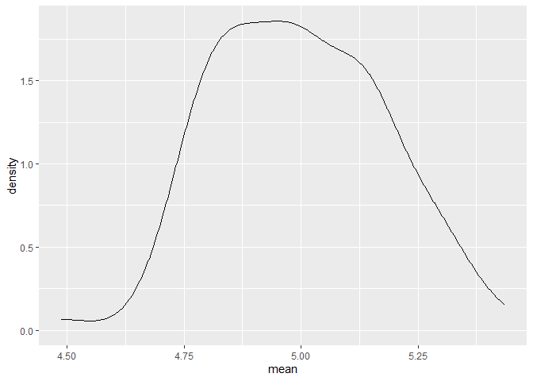
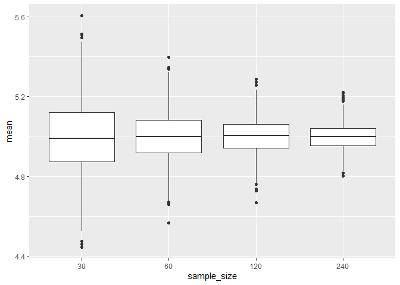
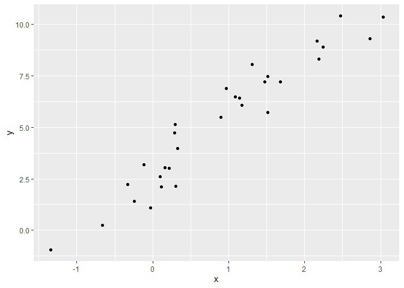
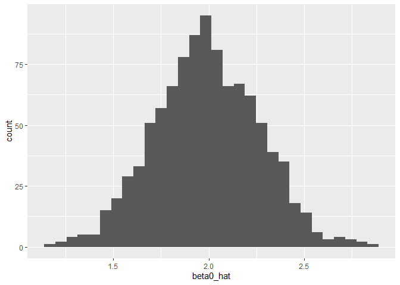
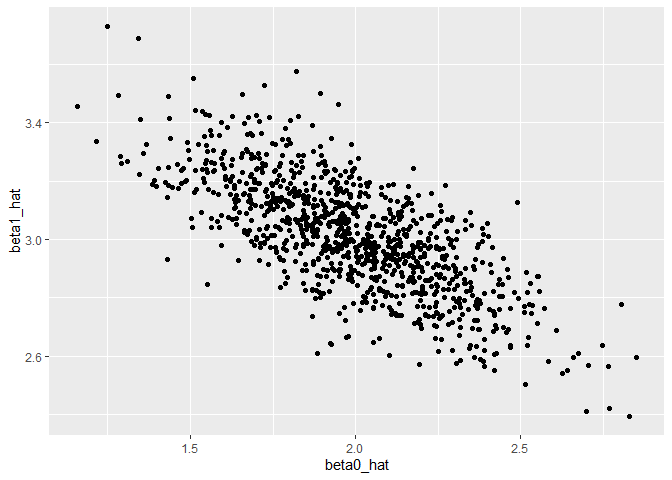

simulation
================
Sitian Zhou
2023-11-02

``` r
library(tidyverse)
```

    ## ── Attaching core tidyverse packages ──────────────────────── tidyverse 2.0.0 ──
    ## ✔ dplyr     1.1.3     ✔ readr     2.1.4
    ## ✔ forcats   1.0.0     ✔ stringr   1.5.0
    ## ✔ ggplot2   3.4.3     ✔ tibble    3.2.1
    ## ✔ lubridate 1.9.2     ✔ tidyr     1.3.0
    ## ✔ purrr     1.0.2     
    ## ── Conflicts ────────────────────────────────────────── tidyverse_conflicts() ──
    ## ✖ dplyr::filter() masks stats::filter()
    ## ✖ dplyr::lag()    masks stats::lag()
    ## ℹ Use the conflicted package (<http://conflicted.r-lib.org/>) to force all conflicts to become errors

``` r
library(rvest)
```

    ## 
    ## Attaching package: 'rvest'
    ## 
    ## The following object is masked from 'package:readr':
    ## 
    ##     guess_encoding

``` r
set.seed(12345)
```

``` r
sim_mean_sd = function(n_obs, mu = 5, sigma = 1) {
  
  x_vec = rnorm(n = n_obs, mean = mu, sd = sigma)
  
  tibble(
    mean = mean(x_vec),
    sd = sd(x_vec)
  )
  
}
```

``` r
sim_mean_sd(n_obs = 30)
```

    ## # A tibble: 1 × 2
    ##    mean    sd
    ##   <dbl> <dbl>
    ## 1  5.08 0.938

``` r
output = vector("list", length = 100)

for (i in 1:100){
  output[[i]] = sim_mean_sd(n_obs = 30)
}

sim_results = 
  bind_rows(output)

sim_results |> 
  ggplot(aes(x = mean)) + geom_density()
```

<!-- -->

``` r
sim_results |> 
  summarize(
    mu_hat = mean(mean),
    sd_hat = sd(mean)
  )
```

    ## # A tibble: 1 × 2
    ##   mu_hat sd_hat
    ##    <dbl>  <dbl>
    ## 1   5.00  0.180

``` r
# mu_hat = mu; sd_hat = sigma / sqrt(n) = 1 / sqrt(30) = 0.18
```

use a map function

``` r
sim_results_df = 
  expand_grid(
    sample_size = c(30, 60, 120, 240), 
    iter = 1:1000
  ) |> 
  mutate(
    estimate_df = map(sample_size, sim_mean_sd)
  ) |> 
  unnest(estimate_df)

sim_results_df |> 
  mutate(
    sample_size = str_c("n" = sample_size),
    sample_size = fct_inorder(sample_size)
  ) |> 
  ggplot(aes(x = sample_size, y = mean)) +
  geom_boxplot()
```

<!-- -->

## SLR

Goal is to write a function that simulates data and then a regression;
then repeat to look at the distribution of estimated coefficients

``` r
beta_0 = 2
beta_1 = 3

sim_data = 
  tibble(
    x = rnorm(n = 30, mean = 1, sd = 1),
    y = beta_0 + beta_1 * x + rnorm(30, mean = 0, sd = 1)
  )

ls_fit = lm(y ~ x, data = sim_data)
ls_fit
```

    ## 
    ## Call:
    ## lm(formula = y ~ x, data = sim_data)
    ## 
    ## Coefficients:
    ## (Intercept)            x  
    ##       2.780        2.763

``` r
sim_data |> 
  ggplot(aes(x = x, y = y)) +
  geom_point()
```

<!-- -->

let’s wrap this into a function

``` r
sim_slr = function(n_obs, beta_0 = 2, beta_1 = 3){

  sim_data = 
    tibble(
      x = rnorm(n = 30, mean = 1, sd = 1),
      y = beta_0 + beta_1 * x + rnorm(30, mean = 0, sd = 1)
    )
  ls_fit = lm(y ~ x, data = sim_data)
  
  tibble(
    beta0_hat = coef(ls_fit)[1],
    beta1_hat = coef(ls_fit)[2]
  )
}

sim_slr(n_obs = 30)
```

    ## # A tibble: 1 × 2
    ##   beta0_hat beta1_hat
    ##       <dbl>     <dbl>
    ## 1      1.69      2.90

run this a whole bunch of times

``` r
sim_results_df = 
  expand_grid(
    sample_size = 30,
    iter = 1:1000
  ) |> 
  mutate(
    estimate_df = map(sample_size, sim_slr)
  ) |> 
  unnest(estimate_df)
```

Let’s look at results

``` r
sim_results_df |> 
  summarize(
    mean_b0_hat = mean(beta0_hat),
    mean_b1_hat = mean(beta1_hat)
  )
```

    ## # A tibble: 1 × 2
    ##   mean_b0_hat mean_b1_hat
    ##         <dbl>       <dbl>
    ## 1        1.99        3.01

``` r
sim_results_df |> 
  ggplot(aes(x = beta0_hat)) +
  geom_histogram()
```

    ## `stat_bin()` using `bins = 30`. Pick better value with `binwidth`.

<!-- -->

``` r
sim_results_df |> 
  ggplot(aes(x = beta0_hat, y = beta1_hat)) +
  geom_point()
```

<!-- -->
